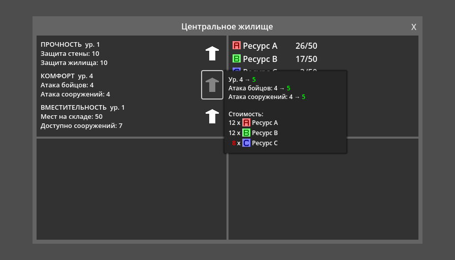

# Defend the Colony




**Внимание:** В настоящее время в Godot 4.x есть баг с тем, что файл
`.godot/global_script_class_cache.cfg` не заполняется автоматически (необходимо
вручную сохранить каждый файл с `class_name`). Вот правильное содержимое этого
файла для данного проекта:


```
list=Array[Dictionary]([{
"base": &"Resource",
"class": &"Building",
"icon": "",
"language": &"GDScript",
"path": "res://data/building.gd"
}, {
"base": &"PanelContainer",
"class": &"BuildingView",
"icon": "",
"language": &"GDScript",
"path": "res://ui/building_view.gd"
}, {
"base": &"HBoxContainer",
"class": &"BuildingViewStat",
"icon": "",
"language": &"GDScript",
"path": "res://ui/building_view_stat.gd"
}])
```
